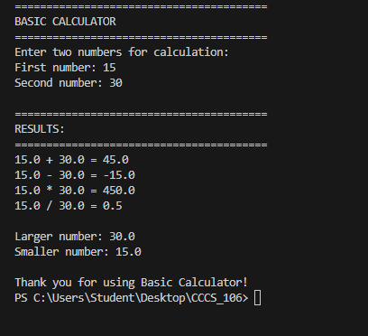
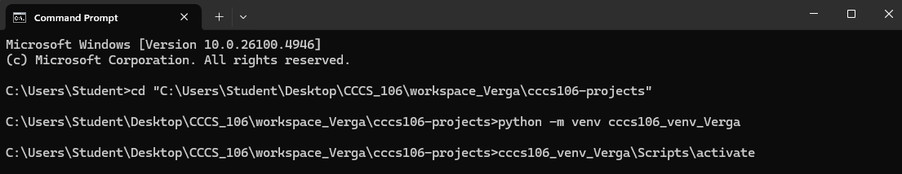
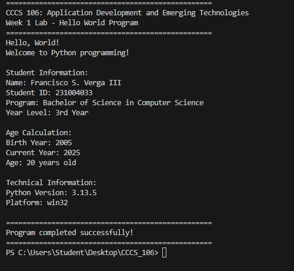
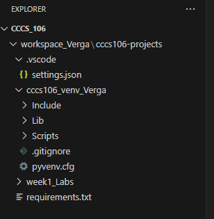

# Lab 1 Report: Environment Setup and Python Basics

**Student Name:** Francisco S. Verga III
**Student ID:** 231004033
**Section:** BSCS-3B
**Date:** 8-27-2025

## Environment Setup

### Python Installation
- **Python Version:** 3.13.5
- **Installation Issues:** Nothing
- **Virtual Environment Created:** ✅ cccs106_env_Verga

### VS Code Configuration
- **VS Code Version:** 1.103.2
- **Python Extension:** ✅ Installed and configured
- **Interpreter:** ✅ Set to cccs106_env_Verga/Scripts/python.exe

### Package Installation
- **Flet Version:** 0.28.3
- **Other Packages:** Nothing

## Programs Created

### 1. hello_world.py
- **Status:** ✅ Completed
- **Features:** Student info display, age calculation, system info
- **Notes:** Shows how Python syntax is easy to read and begginer-friendly.

### 2. basic_calculator.py
- **Status:** ✅ Completed
- **Features:** Basic arithmetic, error handling, min/max calculation
- **Notes:** Shows the importance of input validation for real-world applications.

## Challenges and Solutions

Dealing with compatability issues between libraries and versions. A solution is to use virtual environments to isolate dependences and ensure a clean and manageable setup.

## Learning Outcomes

Ability to comfidently configure a working Python environment using tools, ensuring smooth project development.

## Screenshots

